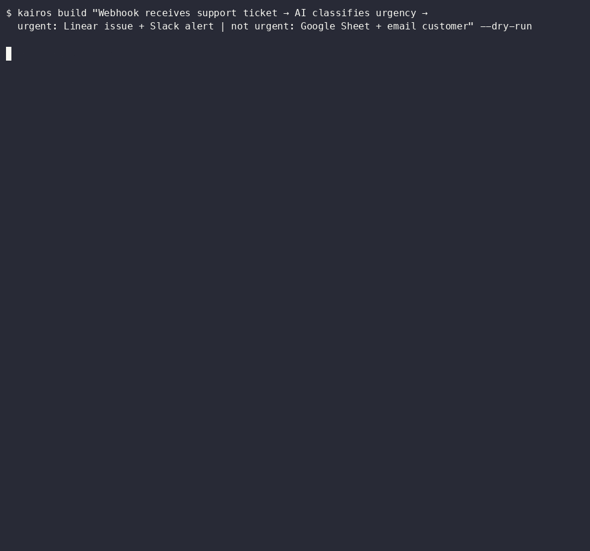

# @kairos-sdk/core

[](https://github.com/Kruttz/kairos-sdk/actions/workflows/ci.yml)
[](https://www.npmjs.com/package/@kairos-sdk/core)
[](https://www.npmjs.com/package/@kairos-sdk/core)

**Turn plain English into deployed n8n workflows — validated, corrected, and deployed in one call.**



Kairos is a TypeScript SDK that takes a natural-language description of an automation, calls Claude to generate n8n workflow JSON, runs it through a **23-rule structural validator** with an automatic correction loop (up to 3 attempts), and deploys the result to your n8n instance via REST API. A local workflow library with **hybrid retrieval** (TF-IDF + node fingerprinting + outcome history + cluster reranking) and telemetry-based feedback inject past failure patterns into future generations. With a seeded template library, Kairos achieves **100% first-try structural validation pass rate** across 20 benchmark prompts (meaning the generated JSON is structurally valid on the first attempt — runtime behavior depends on your credentials and node configuration).

```ts
import { Kairos } from '@kairos-sdk/core'

const kairos = new Kairos({
  anthropicApiKey: process.env.ANTHROPIC_API_KEY!,
  n8nBaseUrl: 'https://your-instance.app.n8n.cloud',
  n8nApiKey: process.env.N8N_API_KEY!,
})

const result = await kairos.build(
  'Every morning at 9am, send a message to #daily-digest on Slack saying "Good morning team!"'
)

console.log(result.workflowId)      // deployed workflow ID
console.log(result.credentialsNeeded) // what the user still needs to configure
```

---

## Installation

```bash
npm install @kairos-sdk/core @anthropic-ai/sdk
```

`@anthropic-ai/sdk` is a peer dependency — install it alongside Kairos.

---

## Requirements

- Node.js 18+
- An [Anthropic API key](https://console.anthropic.com)
- An n8n instance with API access enabled (Cloud or self-hosted)

---

## Quick Start

```ts
import { Kairos } from '@kairos-sdk/core'

const kairos = new Kairos({
  anthropicApiKey: 'sk-ant-...',
  n8nBaseUrl: 'https://your-instance.app.n8n.cloud',
  n8nApiKey: 'your-n8n-api-key',
})

// Dry run — generates and validates but does not deploy
const preview = await kairos.build(
  'Receive a webhook, call an external API, and store the result in Google Sheets',
  { dryRun: true }
)

console.log(preview.name)               // workflow name Claude chose
console.log(preview.generationAttempts) // 1–3 (correction loop)
console.log(preview.credentialsNeeded)  // services that need credentials configured

// Live deploy
const deployed = await kairos.build(
  'Receive a webhook, call an external API, and store the result in Google Sheets'
)

console.log(deployed.workflowId) // now live in n8n
```

---

## Benchmark Results

Tested against 20 workflow prompts of varying complexity (simple triggers, multi-step conditional logic, AI agents with memory). Results measure **structural validation pass rate** — whether the generated workflow passes all 23 validator rules, not end-to-end execution correctness.

### Before vs After: Template-Seeded Library

| Metric | Baseline (no library) | With library (105 templates) | Delta |
|---|---|---|---|
| **First-try pass rate** | 55% (11/20) | **100% (20/20)** | **+45pp** |
| Avg attempts | 1.45 | **1.00** | -0.45 |
| Correction loop usage | 45% | **0%** | -45pp |
| Avg generation time | 30.6s | **20.7s** | -32% |
| Failures | 0 | 0 | — |

The baseline run used Claude with the 22-rule validator and correction loop but no library. The seeded run used the same validator plus a library of 105 workflows (16 organic + 89 ingested from the n8n community). Template seeding eliminated the correction loop entirely and cut generation time by a third.

> **Note:** These results confirm that generated workflows are structurally valid and deployable to n8n. They do not verify runtime execution correctness, credential configuration, or whether the workflow output matches user intent.

---

## How It Works

1. **Search** — Kairos searches its local workflow library for similar past builds. Matching workflows and their failure patterns are pulled into context.
2. **Warn** — Known failure patterns (from library matches and global telemetry rates) are injected into the system prompt so Claude avoids repeating known mistakes.
3. **Generate** — Your description is sent to Claude with a detailed system prompt, forcing a `generate_workflow` tool call that produces structured n8n workflow JSON.
4. **Validate** — The workflow is checked against **22 structural rules** covering node IDs, types, versions, names, positions, connections, forbidden fields, trigger presence, AI connection direction, cycle detection, webhook pairing, and required parameters.
5. **Correct** — If validation fails, the specific rule violations are sent back to Claude for correction (up to 3 attempts, with tighter temperature on the final try).
6. **Strip** — Forbidden server-assigned fields (`id`, `createdAt`, `updatedAt`, etc.) are stripped before deployment.
7. **Deploy** — The validated workflow is posted to your n8n instance via REST API.
8. **Record** — The workflow, its metadata (generation mode, attempt count, failure patterns, credentials needed), and telemetry events are saved locally. Future builds use this history to avoid past mistakes.

---

## Validator Rules

The 22-rule validator is the core of what makes Kairos reliable. In baseline testing (no library), Claude needed the correction loop 45% of the time. Each rule targets a specific class of error:

| Rule | Severity | What it checks |
|------|----------|----------------|
| 1 | error | Workflow has a non-empty name |
| 2 | error | At least one node exists |
| 3 | error | Every node has a non-empty ID |
| 4 | error | No duplicate node IDs |
| 5 | error | Every node has a type string |
| 6 | error | Every node has a valid typeVersion |
| 7 | error | Every node has a valid [x, y] position |
| 8 | error | Every node has a non-empty name |
| 9 | error | Connections is a plain object |
| 10 | error | Every connection target exists in nodes |
| 11 | warn | Non-trigger nodes have incoming connections |
| 12 | error | No forbidden server-assigned fields |
| 13 | error | Settings is a valid object |
| 14 | error | At least one trigger node present |
| 15 | error | Node type strings match expected format |
| 16 | error | No duplicate node names |
| 17 | error | Credentials have valid id/name shape |
| 18 | error | AI connections originate from sub-nodes, not agent roots |
| 19 | warn | typeVersion is within known safe range |
| 20 | warn | No connection cycles (exempts splitInBatches loops) |
| 21 | warn | Webhook with responseMode="responseNode" has respondToWebhook |
| 22 | warn | Required parameters present for known node types |
| 23 | warn | Node type is recognized in the registry (unknown types may not exist in n8n) |

Errors block deployment. Warnings are recorded and fed back into the prompt for future builds.

---

## API Reference

### `new Kairos(options)`

| Option | Type | Required | Description |
|---|---|---|---|
| `anthropicApiKey` | `string` | ✓ | Anthropic API key |
| `n8nBaseUrl` | `string` | ✓ | Base URL of your n8n instance |
| `n8nApiKey` | `string` | ✓ | n8n API key |
| `model` | `string` | | Claude model to use (default: `claude-sonnet-4-6`) |
| `logger` | `ILogger` | | Custom logger (default: silent) |
| `telemetry` | `boolean \| string` | | Enable JSONL telemetry logging (`true` for default dir, or a path) |
| `library` | `IWorkflowLibrary` | | Workflow library for learning loop (default: `NullLibrary`, CLI uses `FileLibrary`) |

---

### `kairos.build(description, options?)`

Generates and optionally deploys a workflow from a plain-English description.

```ts
const result = await kairos.build(description, {
  dryRun: false,   // set true to skip deployment
  name: 'My Workflow', // override the generated name
})
```

**Returns `BuildResult`:**

```ts
{
  workflowId: string | null  // null on dry run
  name: string
  workflow: N8nWorkflow       // the full generated workflow JSON — inspect before deploying
  generationAttempts: number  // 1–3
  activationRequired: boolean // true if workflow needs manual activation
  credentialsNeeded: Array<{
    service: string
    credentialType: string
    description: string
  }>
  dryRun: boolean
}
```

---

### Workflow management

```ts
// List all workflows
const workflows = await kairos.list()

// Get a specific workflow
const workflow = await kairos.get(workflowId)

// Replace a workflow with a fresh generation from a new description
const updated = await kairos.replace(workflowId, 'new description')

// Activate / deactivate
await kairos.activate(workflowId)
await kairos.deactivate(workflowId)

// Delete (requires explicit confirmation)
await kairos.delete(workflowId, { confirm: true })
```

---

### Executions

```ts
// List recent executions for a workflow
const executions = await kairos.executions(workflowId, { limit: 20 })

// Get a specific execution with full details
const detail = await kairos.execution(executionId)
```

---

### Tags

```ts
const tags = await kairos.listTags()
const newTag = await kairos.createTag('production')
await kairos.tag(workflowId, [newTag.id])
await kairos.untag(workflowId, [newTag.id])
```

---

## Error Handling

All errors extend `KairosError` so you can catch them at different levels of specificity:

```ts
import {
  KairosError,
  GenerationError,
  ValidationError,
  ApiError,
  GuardError,
} from '@kairos-sdk/core'

try {
  await kairos.build('...')
} catch (err) {
  if (err instanceof ValidationError) {
    // Claude failed to produce a valid workflow after 3 attempts
    for (const issue of err.issues) {
      console.error(`[Rule ${issue.rule}] ${issue.message}`)
    }
  } else if (err instanceof GenerationError) {
    // Anthropic API call failed (auth, quota, timeout)
    console.error(err.message, err.cause)
  } else if (err instanceof ApiError) {
    // n8n returned a 4xx/5xx
    console.error(`n8n error ${err.statusCode}:`, err.message)
  } else if (err instanceof KairosError) {
    // Any other SDK error
    console.error(err.message)
  }
}
```

| Error class | When it's thrown |
|---|---|
| `GenerationError` | Anthropic API call failed |
| `ResponseParseError` | Claude responded but produced no usable tool call |
| `ValidationError` | Workflow failed 22-rule validation after max retries |
| `ProviderError` | Network/auth failure talking to n8n |
| `ApiError` | n8n returned a 4xx or 5xx (carries `.statusCode`) |
| `GuardError` | Input validation failed (empty description) or `delete()` called without `{ confirm: true }` |

---

## CLI

Deploy workflows from the command line — no code required:

```bash
# Generate and deploy
kairos build "Every morning at 9am, send a Slack digest to #daily-updates"

# Dry run only
kairos build "Monitor a webhook and log payloads" --dry-run

# Seed library with n8n community templates
kairos sync-templates --max 200

# Manage workflows
kairos list
kairos get <workflow-id>
kairos activate <workflow-id>
kairos deactivate <workflow-id>
kairos delete <workflow-id> --confirm
```

Set your credentials as environment variables:

```bash
export ANTHROPIC_API_KEY=sk-ant-...
export N8N_BASE_URL=https://your-instance.app.n8n.cloud
export N8N_API_KEY=your-n8n-key
```

For dry-run mode, only `ANTHROPIC_API_KEY` is required — no n8n setup needed.

---

## Telemetry

Enable telemetry to log every generation attempt, validation result, and token usage to JSONL:

```ts
const kairos = new Kairos({
  anthropicApiKey: '...',
  n8nBaseUrl: '...',
  n8nApiKey: '...',
  telemetry: true, // writes to ~/.kairos/telemetry/
})
```

Or specify a custom directory:

```ts
telemetry: '/path/to/telemetry/dir'
```

Each event includes timestamp, session ID, token counts, validation issues, and duration — useful for benchmarking and analyzing the correction loop.

Kairos also reads telemetry data to compute **per-rule failure rates** across all builds. Rules that fail frequently (>= 15% of builds) are automatically surfaced as warnings in the generation prompt, helping Claude avoid systemic issues. Failure rates use distinct session counting to avoid inflation from retry loops, and results are cached for 5 minutes.

For CLI usage, set `KAIROS_TELEMETRY=true` in your environment.

---

## Workflow Library & Feedback Loop

Kairos includes a file-based workflow library that stores every generation and feeds failure patterns back into future builds:

```ts
import { Kairos, FileLibrary } from '@kairos-sdk/core'

const kairos = new Kairos({
  anthropicApiKey: '...',
  n8nBaseUrl: '...',
  n8nApiKey: '...',
  library: new FileLibrary(), // stores in ~/.kairos/library/
  telemetry: true,            // enables failure rate tracking
})
```

**What gets stored per workflow:**
- The full workflow JSON and description
- Generation mode (`direct`, `reference`, or `scratch` based on library match quality)
- Number of generation attempts needed
- Failure patterns — which validation rules failed and how many times
- Source workflow IDs (which library entries influenced this build)
- Top match score and credentials needed
- Outcome tracking: retrieval count, usage as direct/reference source, first-try pass rate, avg attempts, and failed rules when used as a source

**How retrieval works:**

Kairos uses a **hybrid retrieval** pipeline with four scoring signals, weighted and combined:

| Signal | Weight | What it captures |
|---|---|---|
| TF-IDF keywords | 0.35 | Text similarity between description and stored workflows |
| Node fingerprint | 0.30 | Jaccard similarity between expected node types (extracted from query) and actual nodes in stored workflows |
| Outcome history | 0.20 | First-try pass rate and avg attempts when this workflow was used as a source — proven templates rank higher |
| Deploy frequency | 0.15 | How often a workflow has been deployed — a proxy for usefulness |

After hybrid scoring, results are **reranked by cluster**: workflows are grouped by node fingerprint pattern (e.g., webhook→slack, scheduleTrigger→httpRequest→gmail), and cluster-level success stats boost or penalize candidates. Clusters with high failure rates on specific rules surface those as warnings.

- High-scoring matches (>= 0.92) provide direct structural templates
- Medium matches (>= 0.72) provide reference examples
- Failure patterns from matched workflows and cluster-level warnings are injected into Claude's prompt

**Template seeding:** Run `kairos sync-templates` to ingest validated workflows from the n8n community library. Templates are safety-filtered (blocks code/executeCommand/ssh nodes, hardcoded secrets) and tagged with `sourceKind: 'n8n-template'`. In benchmarks, seeding the library with 89 templates improved first-try pass rate from 55% to 100%.

The CLI automatically enables the library — no configuration needed.

---

## Custom Logger

```ts
const kairos = new Kairos({
  anthropicApiKey: '...',
  n8nBaseUrl: '...',
  n8nApiKey: '...',
  logger: {
    debug: (msg, meta) => console.debug(msg, meta),
    info: (msg, meta) => console.info(msg, meta),
    warn: (msg, meta) => console.warn(msg, meta),
    error: (msg, meta) => console.error(msg, meta),
  },
})
```

---

## Supported n8n Node Types

Kairos knows about 60+ n8n nodes out of the box, including:

- **Triggers:** Webhook, Schedule, Chat, Manual, Email, GitHub, Telegram
- **Core:** HTTP Request, Set, If, Switch, Merge, Code, Wait
- **Apps:** Slack, Gmail, Google Sheets, Notion, Airtable, GitHub, Telegram
- **Data:** PostgreSQL, Redis, S3, Execute SQL
- **AI (LangChain):** Agent, OpenAI Chat Model, Anthropic Claude Model, Buffer Memory, Tool Workflow, Vector Store Retriever

---

## License

MIT — © 2026 Jordan Krutman
